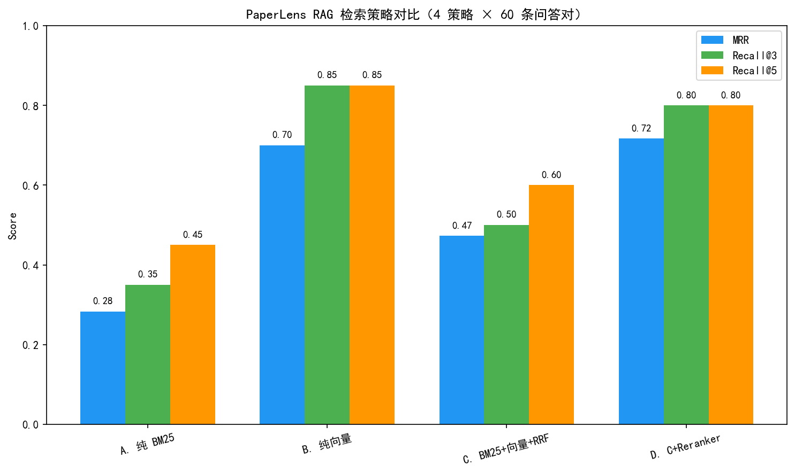

# 📄 PaperLens — 论文研究智能体

> 基于 **LangGraph 多分支 Agent** 的论文研究助手：上传论文 PDF → MinerU 解析 + MiMo 图表理解 → 单篇精读问答 / 一键结构化解读 / 跨多篇论文综述，所有结论可追溯引用来源。


## ✨ 核心功能

- **💬 论文精读**：上传 PDF/DOCX/PPTX，针对单篇论文深度多轮问答（流式响应 + 引用追溯）
- **🔍 结构化解读**：一键生成论文 5 段式解读（研究背景 / 核心方法 / 主要贡献 / 实验结论 / 局限展望）
- **📝 多篇综述**：跨多篇论文自动规划大纲 → **Send 并行检索写作** → 合并综述报告
- **📎 多格式输入**：支持 PDF / DOC / DOCX / PPT / PPTX，非 PDF 自动经 LibreOffice 转 PDF
- **📊 量化评测**：自建 60 条问答集，对比 4 种检索策略，用数据证明工程决策有效

## 🏗️ 系统架构

```
┌─────────────────────────────────────────────────────────┐
│                 Streamlit 前端 (8501)                    │
│   论文管理 │ 论文精读 │ 结构化解读 │ 多篇综述             │
└──────────────────────┬──────────────────────────────────┘
                       ▼
┌─────────────────────────────────────────────────────────┐
│                FastAPI 后端 (8000)                       │
│  ┌───────────────────────────────────────────────────┐  │
│  │         LangGraph StateGraph（核心）              │  │
│  │  triage → [qa | analyze | synthesize | general]   │  │
│  │           ↓           ↓          ↓                │  │
│  │        retrieve    retrieve   planner             │  │
│  │           ↓           ↓          ↓                │  │
│  │         qa_agent  analyze    Send并行×N           │  │
│  │                      ↓          ↓                 │  │
│  │                   assembler ← section_worker      │  │
│  └───────────────────────────────────────────────────┘  │
│  DocumentService: LibreOffice → MinerU → MiMo → 分块    │
└──────────────────────┬──────────────────────────────────┘
                       ▼
        ┌──────────────┴──────────────┐
        ▼                             ▼
┌───────────────┐           ┌─────────────────┐
│ Elasticsearch │           │  Qwen + MiMo    │
│ BM25 + KNN    │           │  API            │
└───────────────┘           └─────────────────┘
```

## 📊 评测结果（简历核心数据）

### 4 种检索策略对比（20 条问答对）

| 策略 | MRR | Recall@3 | Recall@5 |
|------|-----|----------|----------|
| A. 纯 BM25 | 0.283 | 35.0% | 45.0% |
| **B. 纯向量（BGE-m3）** | **0.700** | **85.0%** | **85.0%** |
| C. BM25+向量+RRF | 0.472 | 50.0% | 60.0% |
| D. C+Reranker | 0.717 | 80.0% | 80.0% |

**关键发现**：中英跨语言场景下（中文问题检索英文论文），纯向量 BGE-m3 优于 BM25+向量混合——BM25 对中文 query 检索英文文档效果差，反而拉低 RRF 融合。

### LLM-as-Judge 答案质量（8 条）

| 指标 | 分数 |
|------|------|
| 无 RAG | 2.38 / 5 |
| **有 RAG** | **4.00 / 5** |
| **提升** | **+68.4%** |



## 🔧 环境要求

- **Python 环境**：`conda activate ocr`（MinerU 所在环境，全程必须）
- **Elasticsearch 9.3**：本地安装 + IK 中文分词器
- **MinerU**：`mineru-open-api`（首次 extract 模式需 `mineru-open-api auth`）
- **LibreOffice**：`soffice` 命令（非 PDF 转 PDF）
- **BGE 模型**：本地路径 `E:/ai八斗学院学习/models/BAAI/bge-m3` + `bge-reranker-v2-m3`
- **API Keys**：DashScope（Qwen）+ 小米 MiMo

## 🚀 快速启动

```bash
# 0. 全程在 ocr 环境
conda activate ocr

# 1. 启动 Elasticsearch（本地安装）
cd E:\elasticsearch-9.3.1\elasticsearch-9.3.1
./bin/elasticsearch

# 2. 配置密钥
cp .env.example .env  # 填 DASHSCOPE_API_KEY, MIMO_API_KEY

# 3. 启动后端
cd E:\其他\大模型项目\PaperLens
python -m uvicorn app.main:app --host 127.0.0.1 --port 8000

# 4. 启动前端（新终端，同样 conda activate ocr）
cd frontend
streamlit run app.py --server.port 8501

# 浏览器访问 http://localhost:8501
```

## 📁 项目结构

```
PaperLens/
├── app/
│   ├── main.py              # FastAPI 入口 + 环境自检
│   ├── config.py            # YAML + 环境变量替换
│   ├── schemas.py           # Pydantic 请求/响应
│   ├── exceptions.py        # 全局异常处理
│   ├── core/
│   │   ├── chunker.py       # 滑动窗口分块
│   │   ├── pdf_splitter.py  # PDF 拆分 + LibreOffice 转换 + 命令探测
│   │   ├── embedding.py     # BGE-m3 单例
│   │   ├── reranker.py      # BGE-reranker-v2-m3
│   │   ├── rag_engine.py    # BM25+KNN+RRF+Rerank（修了 4 个 bug）
│   │   └── multimodal.py    # MiMo-v2-omni 图表理解
│   ├── agents/
│   │   ├── state.py         # LangGraph TypedDict 状态
│   │   ├── prompts.py       # 集中 Prompt 管理
│   │   └── graph.py         # StateGraph（triage→4 分支，含 Send 并行）
│   ├── routers/
│   │   ├── documents.py     # 上传/列表/删除 API
│   │   └── chat.py          # 对话 + SSE 流式
│   ├── services/
│   │   └── document_service.py  # MinerU→MiMo→分块→索引 全流水线
│   └── models/orm.py        # SQLAlchemy ORM
├── eval/
│   ├── gen_dataset.py       # 自动生成评测集
│   ├── eval_retrieval.py    # 4 策略对比 + matplotlib
│   ├── eval_answer.py       # LLM-as-Judge
│   ├── dataset.json         # 60 条问答对
│   └── results_chart.png    # 对比图
├── tests/                   # 18 个 pytest 测试（chunker/rag_engine/graph 路由）
├── frontend/                # Streamlit 4 页面
├── config.yaml / .env.example / requirements.txt
└── start_backend.bat        # Windows 启动脚本
```

## 🛠️ 技术栈

LangGraph · FastAPI · Elasticsearch · Streamlit · BGE-m3 · BGE-reranker-v2-m3 · mineru-open-api · LibreOffice · MiMo-v2-omni · Qwen-Plus · SQLite · pytest

## 🧪 测试

```bash
conda activate ocr
python -m pytest tests/ -v
# 18 passed（chunker 2 + rag_engine 5 + graph 路由 11）
```

## 📝 关键工程决策

1. **每篇论文独立 ES 索引**：综述时并行查 N 索引无需 filter；删除=删索引；BM25 词频不受干扰
2. **Send API 并行综述**：planner 生成大纲后，Send 为每个章节启动并行 worker，比串行快 3-5 倍
3. **多格式统一走 PDF**：LibreOffice 转 PDF 后，下游分块/向量化/图表理解只有一条代码路径
4. **mineru-open-api 完整路径探测**：解决 Windows 后台线程 PATH 缺失问题
5. **bin→safetensors 转换**：绕过 transformers 对 torch<2.6 加载 .bin 的安全限制
